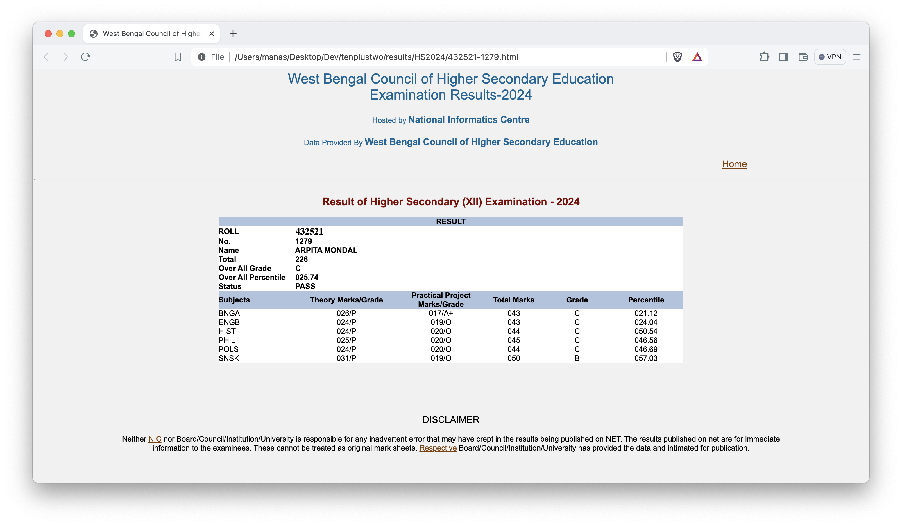

# tenplustwo

_CLI to fetch and save HS and Madhyamik results in bulk_

## Sample HS Result



## Sample Directory Structure

```bash
results
├── HS2024
│   ├── 432521-1247.html
│   ├── 432521-1248.html
│   ├── 432521-1249.html
│   ├── 432521-1250.html
│   ├── 432521-1251.html
│   ├── 432521-1252.html
│   ├── 432521-1253.html
│   ├── 432521-1254.html
│   ├── 432521-1255.html
│   ├── 432521-1256.html
│   ├── 432521-1257.html
│   ├── 432521-1258.html
│   ├── 432521-1259.html
│   ├── 432521-1260.html
│   ├── 432521-1261.html
│   ├── 432521-1262.html
│   ├── 432521-1263.html
│   ├── 432521-1264.html
│   ├── 432521-1265.html
│   ├── 432521-1266.html
│   ├── 432521-1267.html
│   ├── 432521-1268.html
│   ├── 432521-1269.html
│   ├── 432521-1270.html
│   ├── 432521-1271.html
│   ├── 432521-1272.html
│   ├── 432521-1273.html
│   ├── 432521-1274.html
│   ├── 432521-1275.html
│   ├── 432521-1276.html
│   ├── 432521-1277.html
│   ├── 432521-1278.html
│   ├── 432521-1279.html
│   └── 432521-1280.html
└── sampleoutput.png
```

## Usage

- Install the _[tenplustwo](https://www.npmjs.com/package/tenplustwo)_ npm package

```bash
   npm install tenplustwo
```

- Run the _tenplustwo_ command from the CLI

```bash
   tenplustwo -y <year> -r <roll> -l <lower_limit> -u <upper_limit>
   tenplustwo --year <year> --roll <roll> --lower <lower_limit> --upper <upper_limit>
```

## Setting up locally

- Clone the tenplustwo repository

```bash
    git clone git@github.com:sanam2405/tenplustwo.git
    cd tenplustwo
```

- Install the dependencies

```bash
    npm install
```

- Build the source

```bash
    npm run build
```

- Fetch the results

```bash
   npm start -- -y <year> -r <roll> -l <lower_limit> -u <upper_limit>
   npm start -- --year <year> --roll <roll> --lower <lower_limit> --upper <upper_limit>
```

Example

```bash
   npm start -- -y 2024 -r 432521 -l 1247 -u 1350
   npm start -- --year 2024 --roll 432521 --lower 1247 --upper 1350
```
